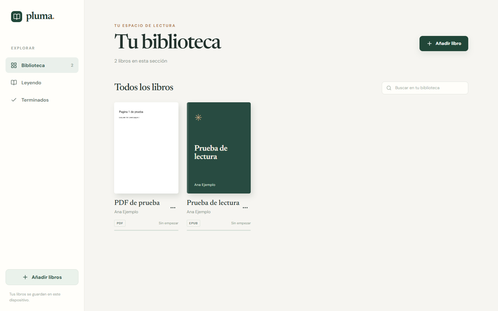
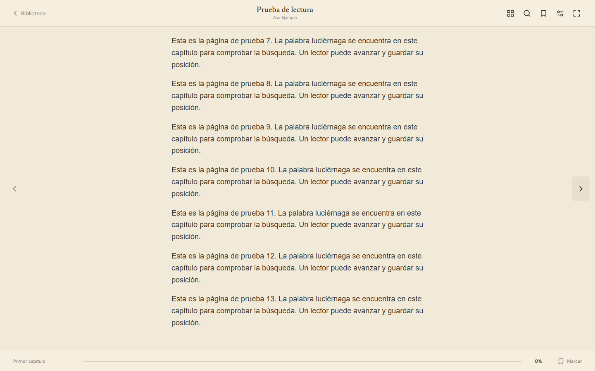
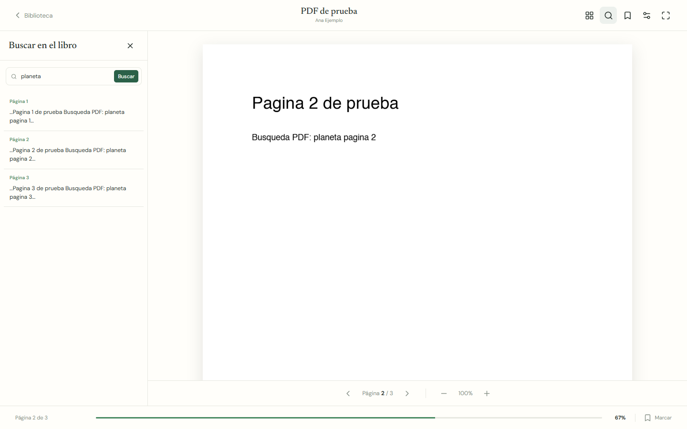

# Pluma

**Pluma** es una aplicación web para organizar y leer libros EPUB y PDF en un solo lugar. Guarda los archivos, la posición de lectura, los marcadores y las preferencias en el navegador del usuario, sin crear una cuenta.

## Vista previa

| Biblioteca | Lector EPUB | Lector PDF |
| --- | --- | --- |
|  |  |  |

Las capturas usan libros de demostración; no se incluyen archivos personales ni libros en el repositorio.

## Funciones

- Importar varios EPUB y PDF desde el selector de archivos o arrastrándolos a la ventana.
- Ver portada, título, autor, formato y progreso en la biblioteca; continuar la lectura desde la última posición.
- Navegar por capítulos y tabla de contenidos de EPUB, o por páginas de PDF.
- Buscar texto dentro de cada libro y guardar marcadores.
- Ajustar fuente, tamaño, interlineado, márgenes y ancho del texto en EPUB.
- Elegir tema claro, sepia u oscuro; leer a pantalla completa.
- Eliminar libros y sus datos locales. Interfaz optimizada para computadoras.

## Tecnologías

React, Vite, epub.js, PDF.js, IndexedDB mediante `idb` y Lucide Icons. La aplicación funciona enteramente en el navegador: los libros no se envían a un servidor.

## Instalación y uso

Necesitas **Node.js 22.13 o posterior de la línea 22, o Node.js 24 o posterior**, y npm.

```bash
git clone https://github.com/MiguelJimenez12/pluma-reader.git
cd pluma-reader
npm ci
npm start
```

`npm start` compila la aplicación y abre la versión de producción en `http://127.0.0.1:4173/`. Pulsa **Añadir libro** para importar tus archivos. La terminal debe permanecer abierta mientras usas Pluma. Después de cerrar la terminal o reiniciar la computadora, entra de nuevo en la carpeta del proyecto y ejecuta `npm start`; solo necesitas repetir `npm ci` si cambian las dependencias o haces una instalación nueva. Si el puerto está ocupado, cierra la instancia anterior de Pluma y vuelve a ejecutar el comando.

Para trabajar en el código con recarga automática:

```bash
npm run dev
```

El servidor de desarrollo abre en `http://127.0.0.1:5173/`. También puedes compilar y revisar la versión de producción por separado:

```bash
npm run build
npm run preview
```

`npm run preview` requiere haber ejecutado `npm run build` antes. Las advertencias de `npm ci` sobre `@types/localforage` y `allow-scripts` proceden de dependencias; no impiden instalar, compilar ni ejecutar Pluma. La instalación verificada no mostró vulnerabilidades en `npm audit`.

## Estructura

```text
src/
  App.jsx           Biblioteca, navegación y ajustes
  EpubReader.jsx    Lector EPUB
  PdfReader.jsx     Visor PDF
  bookImport.js     Importación, metadatos y portadas
  db.js             Persistencia en IndexedDB
  styles.css        Diseño adaptable y temas
docs/screenshots/   Capturas reales de la aplicación
```

## Datos y límites actuales

La biblioteca pertenece al navegador y equipo donde se importó. El servidor de desarrollo (`:5173`) y el de producción (`:4173`) son direcciones distintas y cada una tiene su propia biblioteca local; usa siempre la misma dirección para continuar tus lecturas. Borrar los datos del sitio también borra los libros y el progreso. La búsqueda de PDF requiere texto seleccionable: un PDF escaneado necesitaría reconocimiento de texto. El diseño de escritorio se comprobó a 1024 y 1440 píxeles mediante Chrome automatizado. Una mejora futura sería sincronizar o exportar la biblioteca entre equipos.
