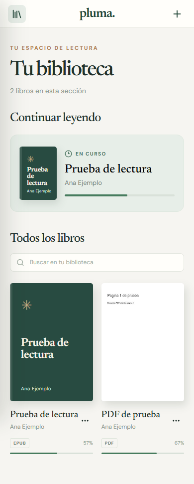

# Pluma

**Pluma** es una aplicación web para organizar y leer libros EPUB y PDF en un solo lugar. Guarda los archivos, la posición de lectura, los marcadores y las preferencias en el navegador del usuario, sin crear una cuenta.

## Vista previa

| Biblioteca | Lector EPUB |
| --- | --- |
|  |  |

| Lector PDF | Diseño móvil |
| --- | --- |
|  |  |

Las capturas usan libros de demostración; no se incluyen archivos personales ni libros en el repositorio.

## Funciones

- Importar varios EPUB y PDF desde el selector de archivos o arrastrándolos a la ventana.
- Ver portada, título, autor, formato y progreso en la biblioteca; continuar la lectura desde la última posición.
- Navegar por capítulos y tabla de contenidos de EPUB, o por páginas de PDF.
- Buscar texto dentro de cada libro y guardar marcadores.
- Ajustar fuente, tamaño, interlineado, márgenes y ancho del texto en EPUB.
- Elegir tema claro, sepia u oscuro; leer a pantalla completa.
- Eliminar libros y sus datos locales. Interfaz adaptable a computadora, tableta y móvil.

## Tecnologías

React, Vite, epub.js, PDF.js, IndexedDB mediante `idb` y Lucide Icons. La aplicación funciona enteramente en el navegador: los libros no se envían a un servidor.

## Instalación y uso

Necesitas **Node.js 22.13 o posterior de la línea 22, o Node.js 24 o posterior**, y npm.

```bash
git clone https://github.com/MiguelJimenez12/pluma-reader.git
cd pluma-reader
npm ci
npm run dev
```

Abre la dirección local que muestre Vite (normalmente `http://127.0.0.1:5173/`) y pulsa **Añadir libro**. Para generar y revisar la versión de producción:

```bash
npm run build
npm run preview
```

## Estructura

```text
src/
  App.jsx           Biblioteca, navegación y ajustes
  EpubReader.jsx    Lector EPUB
  PdfReader.jsx     Visor PDF
  bookImport.js     Importación, metadatos y portadas
  db.js             Persistencia en IndexedDB
  styles.css        Diseño adaptable y temas
docs/screenshots/   Capturas reales de la aplicación
```

## Datos y límites actuales

La biblioteca pertenece al navegador y dispositivo donde se importó. Borrar los datos del sitio también borra los libros y el progreso. La búsqueda de PDF requiere texto seleccionable: un PDF escaneado necesitaría reconocimiento de texto. Una mejora futura sería sincronizar o exportar la biblioteca entre dispositivos.
